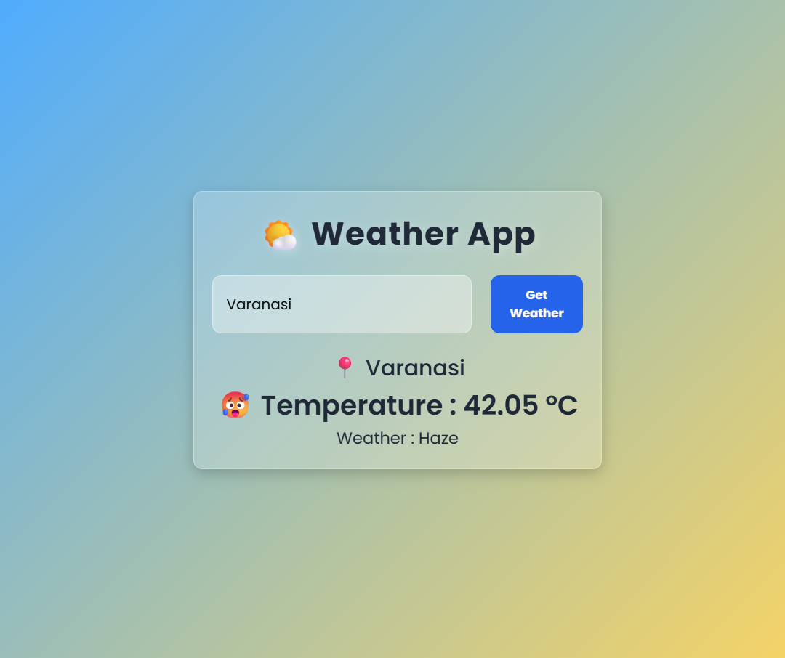

# Weather App 🌤️

A modern weather application built using HTML, CSS, and JavaScript with OpenWeather API integration.

## ✨ Features

- 🌍 Search weather by city name
- 🌡️ Real-time temperature display
- ☁️ Dynamic weather conditions
- 😀 Weather emojis based on temperature
- 📍 Location display
- 🎨 Modern glassmorphism UI
- ⚡ Clean and interactive interface

## 🛠️ Technologies Used

- HTML
- CSS
- JavaScript
- OpenWeather API

## 🔗 API Used

- OpenWeather API

## 📸 Screenshot

